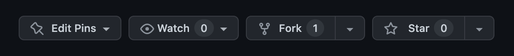
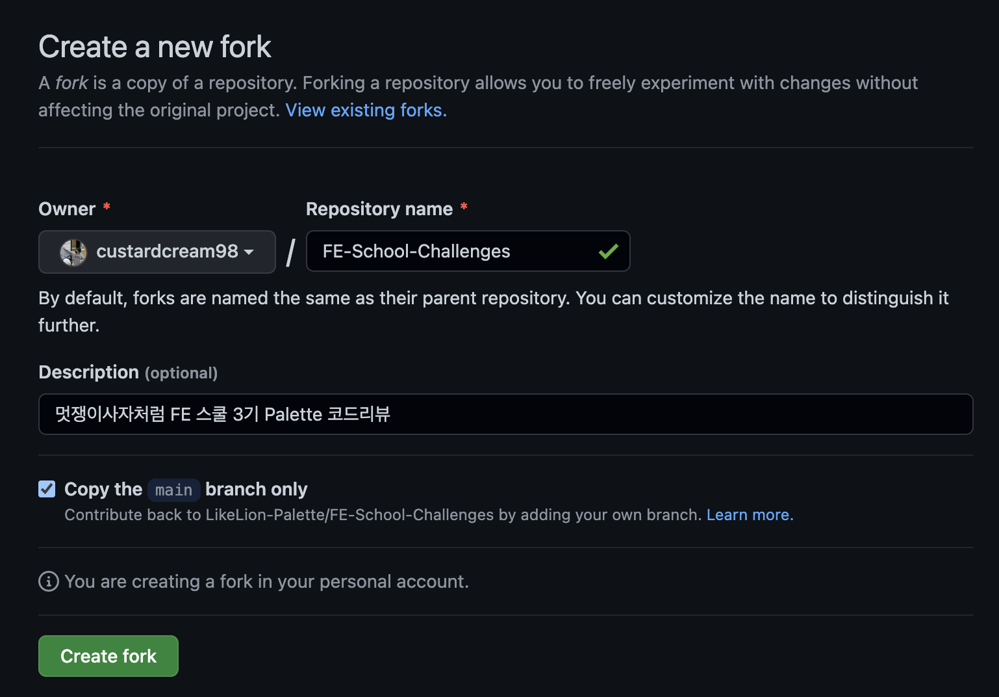
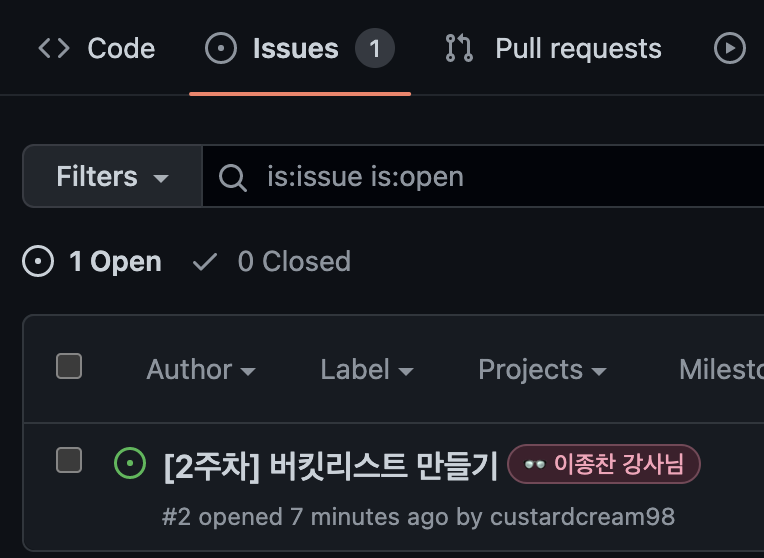
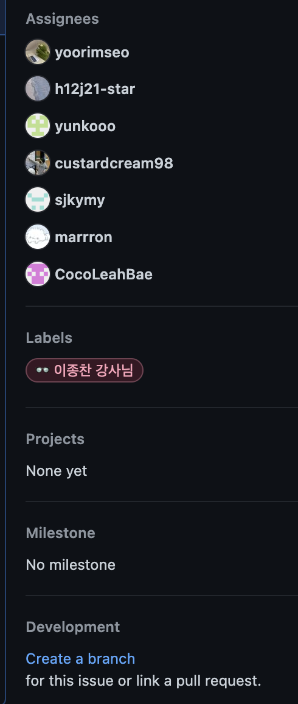
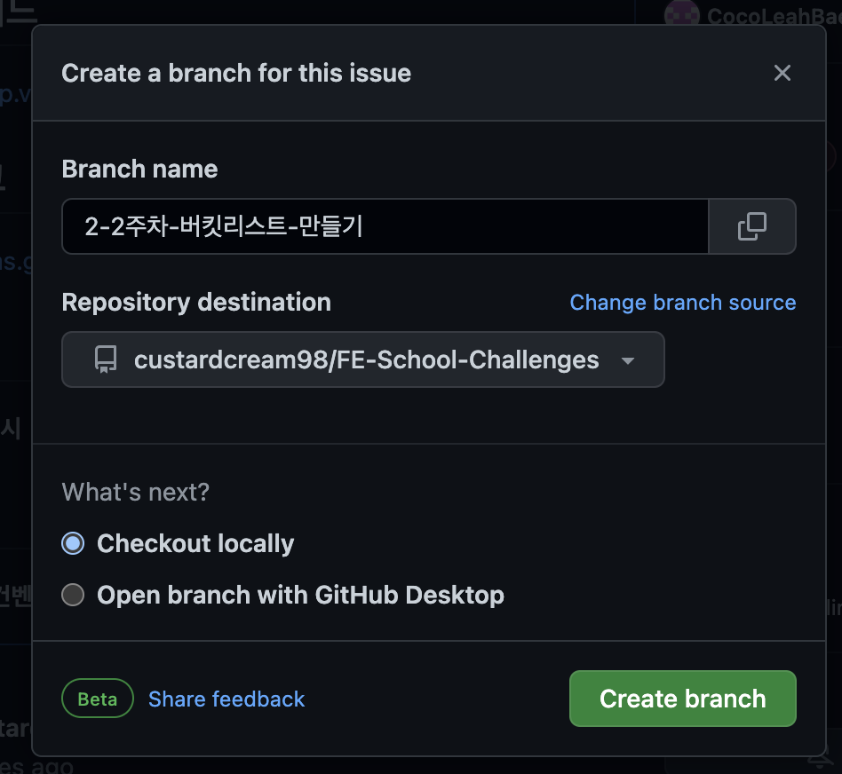

# 처음 시작하는 팀원을 위한 설명서

`원격 저장소`(='remote 레포지토리')는 클라우드(여기에선 Github)에 올라간 저장소를 의미합니다.

저희는 이 원격 저장소를 각자가 연결해 '협업'을 해야 합니다.

아래의 스텝을 따라가주세요.

## 0. VSC Extension 설치 (선택사항)

- `Git Graph`: VSC에서 Git의 브랜치 변경 내역을 편리하게 확인할 수 있도록 도와줍니다.

## 1. 현재 레포지토리를 Fork하기



`fork`를 누릅니다.



`Create Fork`를 누릅니다.


`<본인의 깃헙 닉네임>/FE-School-Challenges` 라는 이름의 원격 저장소가 생성됐다면 포크가 잘 된 것입니다.

> 포크는 다른 사람의 원격 저장소를 복사해서 '내 계정 버전의' 원격 저장소를 만드는 기능입니다. 앞으로 방금 '포크를 뜬' 원격 저장소에 push하는 내용은 오로지 내 레포지토리에만 올라갑니다.

## 2. Fork한 레포지토리를 로컬에 clone하기


방금 포크한 저장소에서 `Code`를 눌러 원격 저장소의 URL을 복사한 후, 아래의 명령어를 터미널에 입력합니다.

```console
cd 클론한/저장소가/위치할/경로로/이동
git clone <방금_복사한_URL>
```

> 클론은 원격 저장소를 '복사'해서 로컬에 다운로드 받는 것을 의미합니다. 저장소 자체를 복사하기 때문에 `.git`이 자동으로 생성됩니다.

아래 명령어를 입력해서 제대로 연결됐는지 확인해보세요. `origin`이라는 이름의 원격 저장소가 본인의 원격 저장소 URL로 연결돼있으면 됩니다.

```console
git remote -v
```

## 3. 원본 저장소 연결하기

협업을 통해 원본 저장소에 코드들이 올라왔다고 생각해보면, 변경된 내용을 로컬로도 가지고 올 수 있어야 합니다. 아래 명령어를 입력해서 원본 저장소와도 연결해줍니다.

```console
git remote add upstream https://github.com/LikeLion-Palette/FE-School-Challenges.git
# 원본 원격 저장소를 'upstream'이라는 이름으로 로컬 저장소에 추가합니다.
```

입력했다면 아래 명령어로 제대로 연결됐는지 확인합니다. `upstream`이라는 이름으로 원본 저장소가 연결돼있으면 됩니다.

```console
git remote -v
```

현 상태에서 저장소는 아래의 세가지가 있습니다.

- 로컬 저장소: 포크 뜬 저장소를 내 컴퓨터로 `clone`한 저장소
- 포크 뜬 저장소(로컬 저장소 입장에서는 `origin`): `<깃헙_닉네임>/FE-School-Challenges`
- 원본 저장소(로컬 저장소 입장에서는 `upstream`): `LikeLion-Palette/FE-School-Challenges`

협업 전략은 아래와 같습니다. (우선은 흐름을 알아두세요!!)

1. 로컬에 변경을 `commit`
2. 로컬에서 `origin`으로 `push`
3. `upstream`에 반영하기
  1. PR하기 전에, `upstream`에 바뀐 내용이 없는 경우: `origin`에서 `upstream`으로 PR(Pull Request)
  2. PR하기 전에, `upstream`에 바뀐 내용이 있는 경우
    1. `upstream`에서 로컬로 `pull`
    2. 로컬에서 `origin`으로 `push`
    3. `origin`에서 `upstream`으로 PR

> Pull Request, PR이란 원본 저장소에 '내가 변경한 내용을 보고 맘에 들면 합쳐(merge)줘!' 라고 요청하는 행위입니다.

### 3-0. Git pull 설정

저희가 사용할 git pull 전략은 `rebase`를 사용하지 않고 단순 `merge`를 하는 방식입니다. (자세한건 알잘딱깔센 참고)

아래 명령어를 입력해 설정해주세요.

```console
git config pull.rebase false
```

### 3-1. 원본 저장소로부터 코드 가져오기

이 단계는 앞으로 본인의 코드를 작성하거나 올리기 전에 꼭 해줘야 충돌이 일어나지 않습니다.

```console
git pull upstream main
# upstream 저장소의 main 브랜치로부터 바뀐 내용을 가져오겠다는 의미입니다.
```

원본 저장소와 차이가 있는 부분이 있을 경우 몇 개의 파일이 얼마나 바뀌었는지 출력되고, 그렇지 않은 경우엔 'Already up to date.'가 출력됩니다.

**__꼭 본인의 코드를 올리기 전에 이 단계를 먼저 수행해주세요!__**

## 4. `issue` 확인하고 과제를 위한 브랜치 생성하기

[원본 레포지토리의 `issues` 탭](https://github.com/LikeLion-Palette/FE-School-Challenges/issues)에 들어가보시면 과제가 열려있습니다.



앞으로 조장이 과제가 생길때마다 이렇게 issues를 오픈하겠습니다. 참고해 브랜치를 생성해주시면 됩니다.

> 원래 `issue`는 협업시 개발이 필요한 내용을 말 그대로 '이슈 제기'하는 곳입니다. 예를 들어 버튼 개발이 필요하다면 '버튼 개발하기' 라는 이름의 이슈를 열고, 관련 내용을 적는 것입니다. 이렇게 함으로써 프로젝트를 위해 앞으로 어떤 것들을 해결해 나가야 하는지 쉽게 알 수 있습니다.

<!-- 


과제 이슈를 클릭해 **우측에 위치한** `Create a branch`를 클릭해주세요.



`Repository destination`이 `<본인 깃헙 닉네임>/FE-School-Challenges`가 맞는지 확인해주세요. **과제를 위한 브랜치를 아까 포크떴던 레포지토리에 자동 생성**하는겁니다.

> 깃헙은 이런식으로 이슈를 열면 그 이슈와 관련된 작업을 할 수 있도록 브랜치를 편리하게 생성해줍니다. 참고로 여기서 생성되는 브랜치의 이름은 issue 이름으로 자동으로 설정되고, 맨 앞에 붙는 숫자(예시에서는 2)는 issue 번호를 의미합니다.

확인이 됐다면 `Create branch`를 클릭해주세요. -->

> Create branch 기능을 사용해도 되는데 저희는 직접 브랜치를 생성해보겠습니다.

여기까지 확인됐다면 다시 터미널로 돌아와서 아래의 명령어를 입력해주세요.

```console
git checkout -b <네이밍_컨벤션에_맞는_브랜치명>
```

**브랜치 네이밍 컨벤션은 매 issue마다 올려놓겠습니다. 꼭 확인 후 컨벤션에 맞게 브랜치 이름을 설정해주세요.**

명령어를 입력했다면 `main` 브랜치에서 방금 생성한 브랜치로 자동으로 옮겨갔을겁니다.

## 5. 커밋하기

이 상태에서 올릴 파일을 위치시킨 후, 아래의 명령어로 커밋합니다. 커밋 메세지는 아래처럼 해주세요!

```console
git add .
git commit -m "#2 <본인_이름> 과제 업로드"
# 여기에서 #숫자는 issue 번호를 의미합니다. 과제의 이슈 번호를 잘 보고 넣어주세요.
git push --set-upstream origin <브랜치_이름>
# 단순히 git push를 하는게 아니라 --set-upstream origin <브랜치_이름>을 추가하는 이유는
# 아직 Github에는 방금 생성한 과제용 브랜치가 올라가있지 않기 때문입니다.
```

그럼 origin에 커밋이 push됩니다.

## 6. PR 날리기


깃헙으로 들어와서 **포크한 본인의 레포지토리(origin)**로 갑니다. `Pull requests` 탭으로 이동한 뒤 `New pull request`를 누릅니다.


내 레포지토리*에서* 원본 레포지토리*로* 날리는 PR이 맞는지 확인하고, 내 레포지토리의 **브랜치가 제대로 선택됐는지 확인**합니다. 커밋 내역도 확인해보시고 확인 됐다면 `Create pull request`를 눌러주세요.


위 사진처럼 `Revieweers`에 다른 팀원들을 모두 추가해주시고, `Assignees`에는 `assign-yourself`를 눌러 자기 자신을 지정해주세요. `Labels`도 적절한 라벨을 설정해주세요.

더 남기고 싶은 말이 있다면 적어주시고, 모두 완료됐다면 `Create pull request`를 누릅니다.

> 누르기 전에! PR 제목에 과제 이슈 번호가 제대로 들어갔는지 꼭 확인해주세요 ✅

제대로 PR을 날리셨다면 이렇게 리뷰가 필요하다는 메세지가 뜰겁니다!


모든 팀원이 리뷰를 마쳐야 merge가 진행됩니다.

> 참고로 일단 PR를 날리면 추가 수정이 필요할 때 로컬에서 커밋한 후 origin에 push하면 PR에도 알아서 commit이 올라갑니다.

## 7. 코드 리뷰하기

[이 링크](https://xo.dev/github-collaboration-guide/#%EC%BD%94%EB%93%9C-%EB%A6%AC%EB%B7%B0-%ED%95%98%EA%B8%B0)를 참고해 코드를 리뷰해주세요!