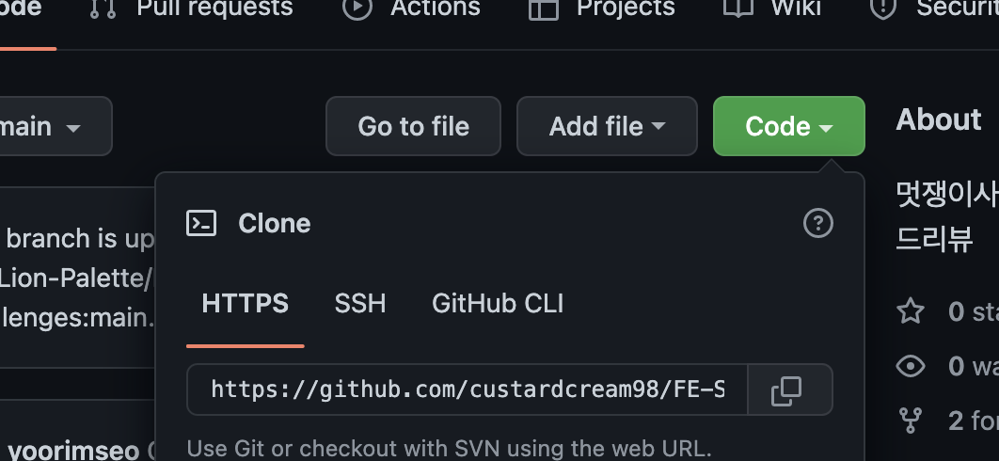

# Team Palette Challenges Repo

멋쟁이 사자처럼 프론트엔드 스쿨 3기에서 만난 🎨 `Palette`의 Code Review를 위한 repo입니다.

# 처음 시작하는 팀원을 위한 설명서

`원격 저장소`(='remote 레포지토리')는 클라우드(여기에선 Github)에 올라간 저장소를 의미합니다.

저희는 이 원격 저장소를 각자가 연결해 '협업'을 해야 합니다.

아래의 스텝을 따라 환경을 구성해주세요.

## 0. VSC Extension 설치 (선택사항)

- `Git Graph`: VSC에서 Git의 브랜치 변경 내역을 편리하게 확인할 수 있도록 도와줍니다.

## 1. 현재 레포지토리를 Fork하기


`fork`를 누릅니다.


`Create Fork`를 누릅니다.


`<본인의 깃헙 닉네임>/FE-School-Challenges` 라는 이름의 원격 저장소가 생성됐다면 포크가 잘 된 것입니다.

> 포크는 다른 사람의 원격 저장소를 복사해서 '내 계정 버전의' 원격 저장소를 만드는 기능입니다. 앞으로 방금 '포크를 뜬' 원격 저장소에 push하는 내용은 오로지 내 레포지토리에만 올라갑니다.

## 2. Fork한 레포지토리를 로컬에 clone하기



방금 포크한 저장소에서 `Code`를 눌러 원격 저장소의 URL을 복사한 후, 아래의 명령어를 터미널에 입력합니다.

```console
cd 클론한/저장소가/위치할/경로로/이동
git clone <방금_복사한_URL>
```

> 클론은 원격 저장소를 '복사'해서 로컬에 다운로드 받는 것을 의미합니다. 저장소 자체를 복사하기 때문에 `.git`이 자동으로 생성돼 따로 설정을 해 줄 필요는 없습니다.

## 3. `issue` 확인하고 과제를 위한 브랜치 생성하기

[원본 레포지토리의 `issues` 탭](https://github.com/LikeLion-Palette/FE-School-Challenges/issues)에 들어가보시면 과제가 열려있습니다.


앞으로 조장이 과제가 생길때마다 이렇게 issues를 오픈하겠습니다. 참고해 브랜치를 생성해주시면 됩니다.

> 원래 `issue`는 협업시 개발이 필요한 내용을 말 그대로 '이슈 제기'하는 곳입니다. 예를 들어 버튼 개발이 필요하다면 '버튼 개발하기' 라는 이름의 이슈를 열고, 관련 내용을 적는 것입니다. 이렇게 함으로써 프로젝트를 위해 앞으로 어떤 것들을 해결해 나가야 하는지 쉽게 알 수 있습니다.


과제 이슈를 클릭해 **우측에 위치한** `Create a branch`를 클릭해주세요.


`Repository destination`이 `<본인 깃헙 닉네임>/FE-School-Challenges`가 맞는지 확인해주세요. **과제를 위한 브랜치를 아까 포크떴던 레포지토리에 자동 생성**하는겁니다.

> 깃헙은 이런식으로 이슈를 열면 그 이슈와 관련된 작업을 할 수 있도록 브랜치를 편리하게 생성해줍니다.

확인이 됐다면 `Create branch`를 클릭해주세요.

## 4. 원격에 생성된 과제용 브랜치를 로컬로 받아오기

여기까지 했다면 지금은 '포크떴던 저장소에는 과제용 브랜치가 생성됐지만, 로컬 환경에는 반영이 안된 상태' 입니다.

이렇게 원격 저장소에 변경이 있을 경우 로컬에 그 변경 내역을 가져오는 방법은 `git fetch`와 `git pull` 명령어를 사용하는겁니다.

터미널에서 클론한 레포지토리의 경로로 이동한 뒤 아래 명령어를 입력합니다.

```console
git fetch origin
```

<!-- `git fetch`는 원격 저장소의  -->
